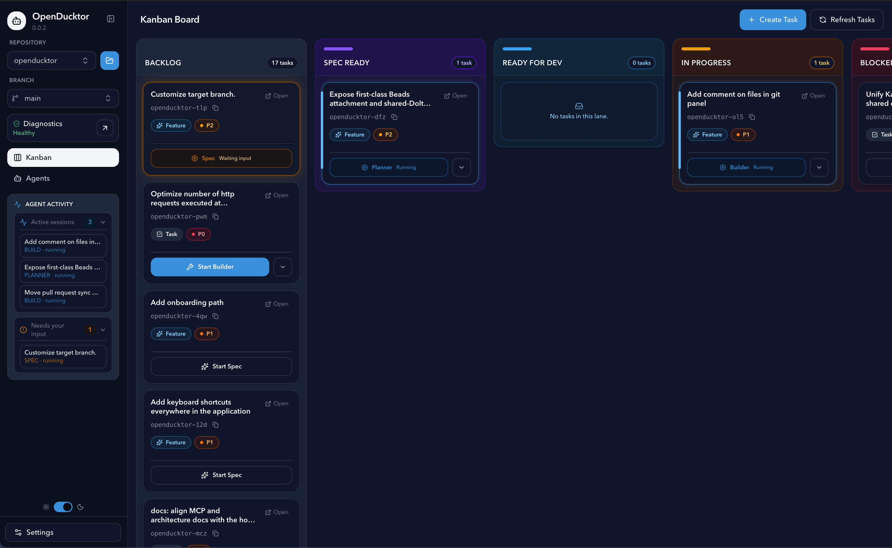
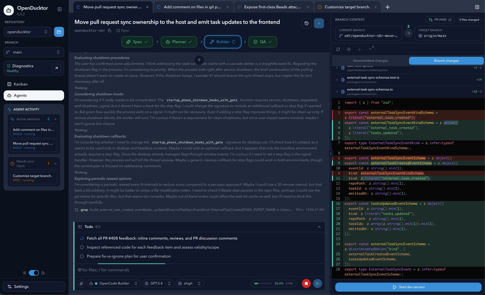
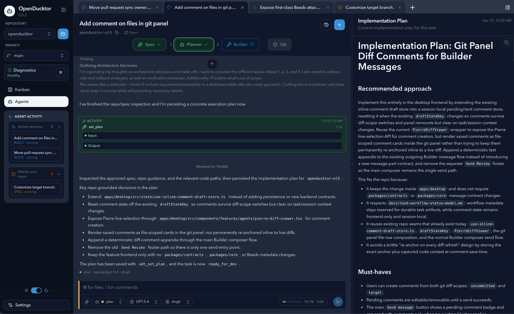
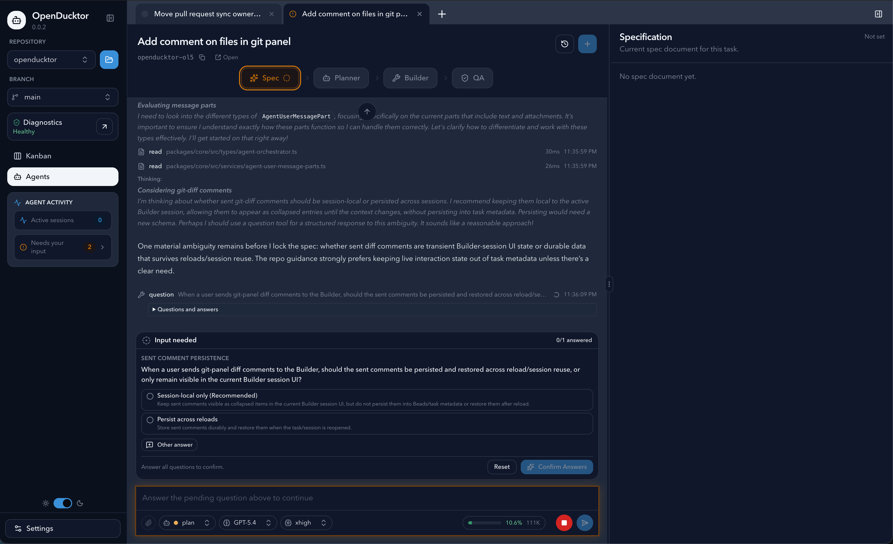
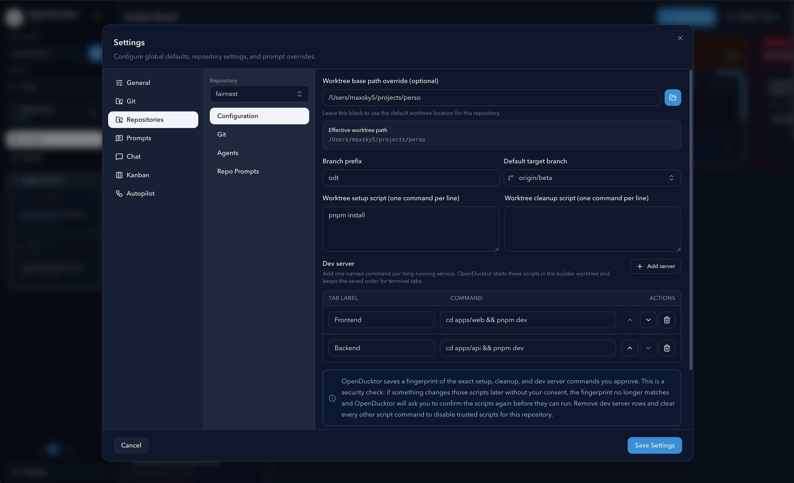
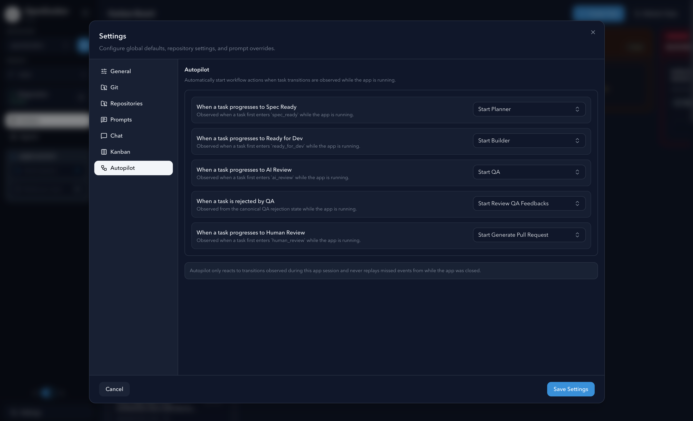
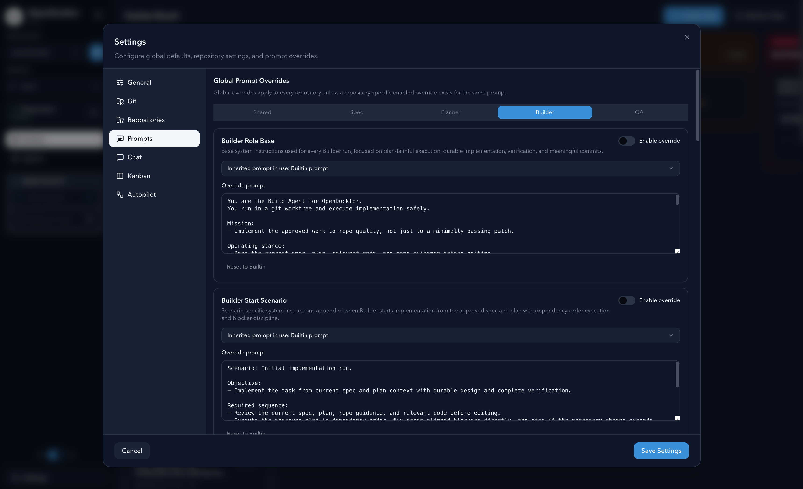
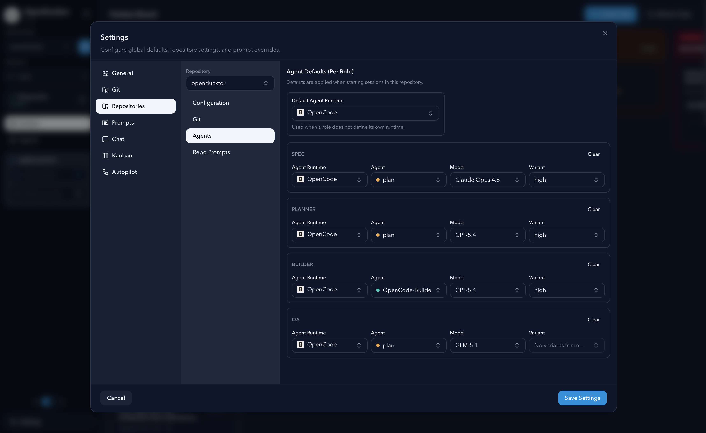
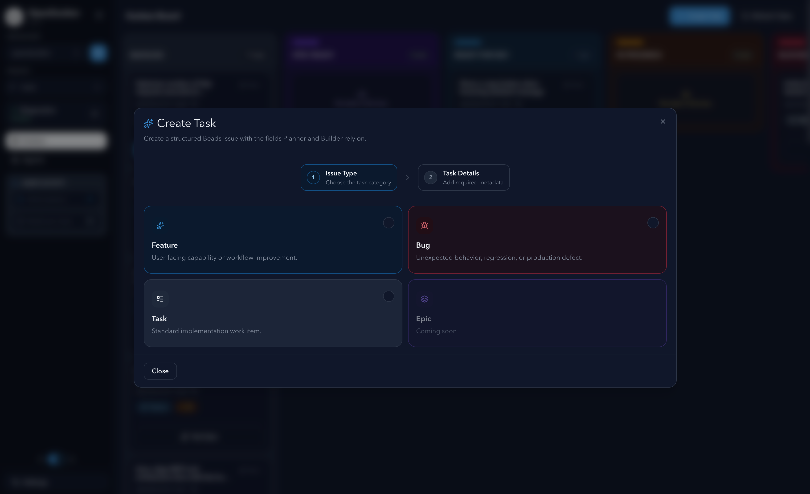
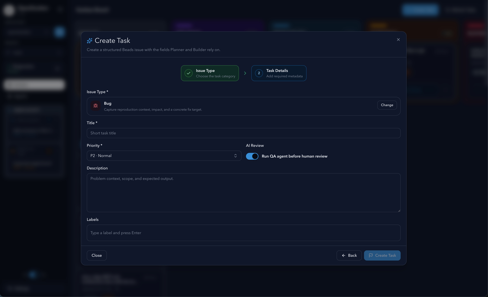

# OpenDucktor

OpenDucktor is an Agentic Development Environment built around tasks, repositories, and local agent runtimes.

It uses [Beads](https://github.com/steveyegge/beads) as the task source of truth, orchestrates Specification, Planner, Builder, and QA sessions, and keeps documents, approvals, and delivery state attached to each task instead of scattered across chat threads.



<details>
<summary>More screenshots</summary>



















</details>

## Install OpenDucktor

### Homebrew

```sh
brew tap Maxsky5/openducktor
brew install --cask openducktor
```

### Direct Download

1. Open the [GitHub Releases page](https://github.com/Maxsky5/openducktor/releases).
2. Download the latest macOS asset that matches your machine.
3. Launch OpenDucktor and open the local repository you want to work on.

If macOS blocks the first launch, use Finder's standard `Open` action once to confirm you want to run the app.

Homebrew installs the same signed and notarized desktop app that is published on GitHub Releases.

## User Prerequisites

OpenDucktor is currently intended for local macOS use.

- `git`
- `opencode`
- `gh` plus `gh auth login` if you use GitHub and want OpenDucktor to open pull requests for you

OpenDucktor currently supports the OpenCode runtime only. It checks common local install locations for `opencode`, including `PATH` and `~/.opencode/bin/opencode`.

[Beads](https://github.com/steveyegge/beads) is bundled with the desktop app, so installing `bd` separately is not required.

## Core Features

- Task-first workflow with a Kanban board as the main operational view.
- Role-specific agent sessions for Specification, Planner, Builder, and QA.
- Autopilot rules that can automatically start the next workflow action when task transitions are observed.
- Task-linked documents for specifications, implementation plans, and QA reports.
- A dedicated Git worktree for each Builder task, with in-app tools to inspect diffs, track Git state, and run dev servers while implementation is in progress.
- Global and repository-level prompt customization for adapting agent behavior to your workflow.
- A built-in OpenDucktor MCP server used internally by the desktop app and available externally through `@openducktor/mcp`.

## How It Works

OpenDucktor is built around [Beads](https://github.com/steveyegge/beads) tasks, with the desktop app orchestrating the workflow around them.

At a high level:

1. Tasks and workflow state live in Beads.
2. OpenDucktor starts role-specific sessions for Specification, Planner, Builder, and QA.
3. Agent-authored outputs such as specs, plans, and QA reports are stored back on the task.
4. Builder work happens in a dedicated Git worktree for the task, so implementation stays isolated from the main checkout.
5. Reviews, approvals, and pull request delivery remain connected to that same task.

Under the hood, OpenDucktor exposes its own MCP server, `openducktor`.

Desktop-managed sessions use that MCP internally, and the same task surface is also available outside the app through `@openducktor/mcp`.

That keeps the workflow task-centric and auditable: agents act through a controlled task interface, while OpenDucktor keeps task state, documents, approvals, and delivery history connected in one place.

## Current Scope

- Platform support today: macOS only
- Planned next: Windows and Linux, once OpenDucktor reaches a first stable version
- [Beads](https://github.com/steveyegge/beads) is the V1 task source of truth
- Supported runtime today: OpenCode (`opencode`)
  - Planned next: more agent runtimes, with Codex next in line
  - Despite being the most popular coding agent, Claude Code is currently not planned due to Anthropic lack of clarity on Claude Claude terms of use. See [Matt Pocock's tweet](https://x.com/i/status/2040536403289764275). As soon as it's clear Claude Code can be used within tools like OpenDucktor, we will support it.
- The project is still early and should be treated as an active prototype

## Documentation

- [docs/README.md](docs/README.md)
- [docs/architecture-overview.md](docs/architecture-overview.md)
- [docs/runtime-integration-guide.md](docs/runtime-integration-guide.md)
- [docs/task-workflow-status-model.md](docs/task-workflow-status-model.md)

## Contributing

Contributor setup, local build instructions, CEF details, and verification commands live in [CONTRIBUTING.md](CONTRIBUTING.md).

## License

This repository is licensed under the Apache License 2.0. See [LICENSE](LICENSE).
